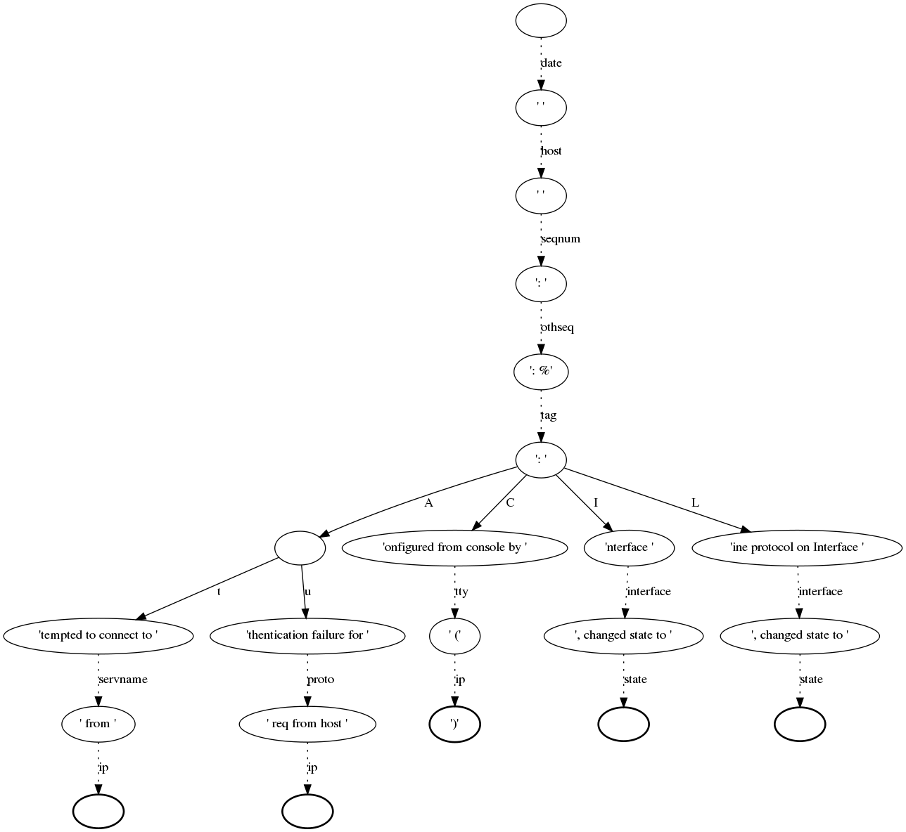

Lognormalizer
=============

Lognormalizer is a sample tool which is often used to test and debug 
rulebases before real use. Nevertheless, it can be used in production as 
a simple command line interface to liblognorm.

This tool reads log lines from its standard input and prints results 
to standard output. You need to use redirections if you want to read 
or write files.

An example of the command::

    $ lognormalizer -r messages.sampdb -o json <messages.log

Command line options
--------------------

::

    -r <FILENAME>

Specifies name of the file containing the rulebase.

::

    -v
    
Increase verbosity level. Can be used several times.

::

    -p

Print only successfully parsed messages.

::

    -t <TAG>
    
Print only those messages which have this tag.
    
::

    -e <json|xml|csv>   

Output format. By default, output is in Mitre CEE format. With this option, you can change it to JSON, XML or CSV.

::

    -T

Include 'event.tags' attribute when output is in JSON format. This attribute contains list of tags of the matched 
rule.

::

    -E <DATA>

Encoder-specific data. For CSV, it is the list of fields to be output, 
separated by comma or space. It is currently unused for other formats.

::

    -d <FILENAME>

Generate DOT file describing parse tree. It is used to plot parse graph 
with GraphViz.

Examples
--------

These examples were created using sample rulebase from source package.

Default (CEE) output::

	$ lognormalizer -r rulebases/sample.rulebase
	Weight: 42kg
	[cee@115 event.tags="tag2" unit="kg" N="42" fat="free"]
	Snow White and the Seven Dwarfs
	[cee@115 event.tags="tale" company="the Seven Dwarfs"]
	2012-10-11 src=127.0.0.1 dst=88.111.222.19
	[cee@115 dst="88.111.222.19" src="127.0.0.1" date="2012-10-11"]

JSON output, flat tags enabled::

	$ lognormalizer -r rulebases/sample.rulebase -e json -T
	%%
	{ "event.tags": [ "tag3", "percent" ], "percent": "100", "part": "wha", "whole": "whale" }
	Weight: 42kg
	{ "unit": "kg", "N": "42", "event.tags": [ "tag2" ], "fat": "free" }

CSV output with fixed field list::

	$ lognormalizer -r rulebases/sample.rulebase -e csv -E'N unit'
	Weight: 42kg
	"42","kg"
	Weight: 115lbs
	"115","lbs"
	Anything not matching the rule
	,

Creating a graph of the rulebase
--------------------------------

To get a better overview of a rulebase you can create a graph that shows you 
the chain of normalization (parse-tree).

At first you have to install an additional package called graphviz. Graphviz 
is a tool that creates such a graph with the help of a control file (created 
with the rulebase). `Here <http://www.graphviz.org/>`_ you will find more 
information about graphviz.

To install it you can use the package manager. For example, on RedHat 
systems it is yum command::

    $ sudo yum install graphviz

The next step would be creating the control file for graphviz. Therefore we 
use the normalizer command with the options -d "prefered filename for the 
control file" and -r "rulebase"::

    $ lognormalize -d control.dot -r messages.rb

Please note that there is no need for an input or output file.
If you have a look at the control file now you will see that the content is 
a little bit confusing, but it includes all information, like the nodes, 
fields and parser, that graphviz needs to create the graph. Of course you 
can edit that file, but please note that it is a lot of work.

Now we can create the graph by typing::

    $ dot control.dot -Tpng >graph.png

dot + name of control file + option -T -> file format + output file

That is just one example for using graphviz, of course you can do many 
other great things with it. But I think this "simple" graph could be very 
helpful for the normalizer.

Below you see sample for such a graph, but please note that this is 
not such a pretty one. Such a graph can grow very fast by editing your 
rulebase.

